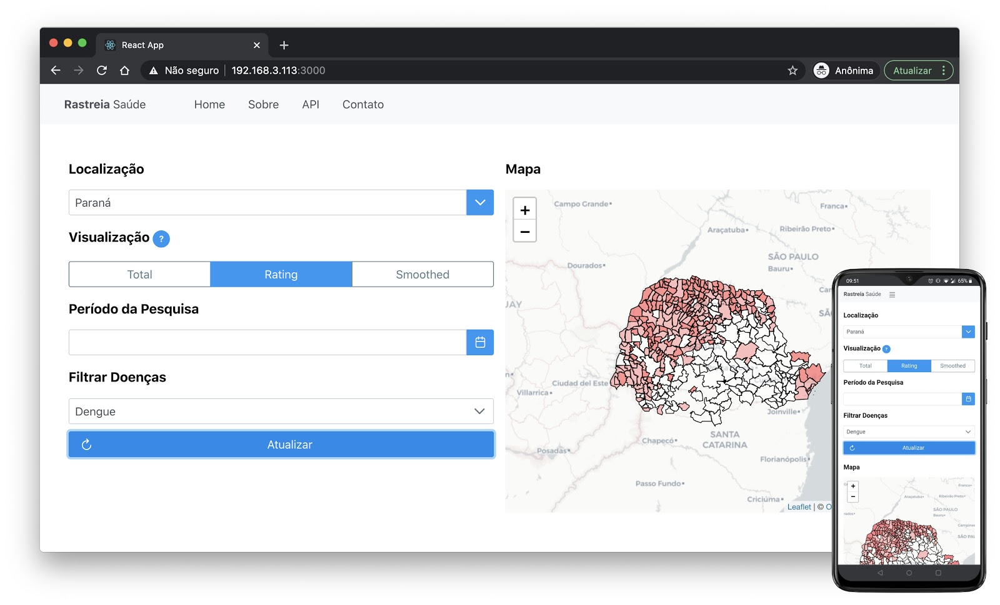

# Rastreia Saúde

This project offers a WEB visualization for the disease tracker "Rastreia Saúde".



First you have to configure the [Rastreia Saúde - Extractor](https://github.com/luizhcardim/rastreiasaude-extractor).

Then, add a .env.local file in the project root, with the following content:

```bash 
DB_HOST=127.0.0.1
DB_PORT=5432
DB_NAME=<db where you create the tables>
DB_USER=<username to access the created tables>
DB_PASS=<password of the user>

JWT_SIGNING_PRIVATE_KEY=<create a private JWT signing key>

NEXTAUTH_URL=http://localhost:3000
```

Then, install the packages of the Rastreia Saúde:

```bash
npm i
```

Then just run the system like any next.js project:

```bash
node run dev
```


Open [http://localhost:3000](http://localhost:3000) with your browser to see the result.

